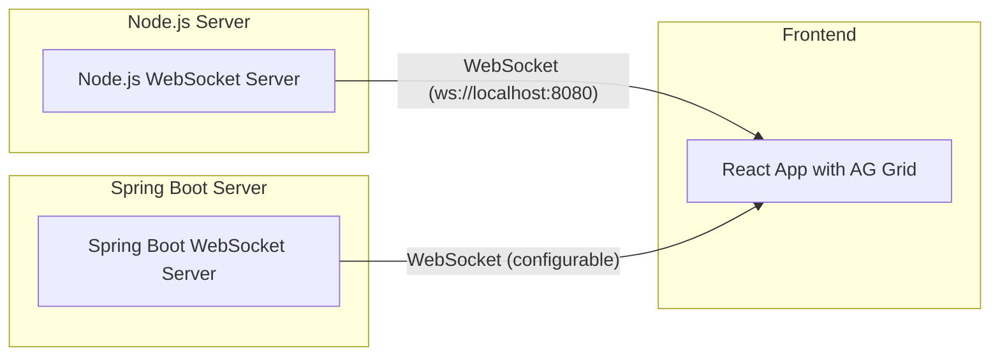

# Mock WebSocket Stock Project

This project simulates real-time stock data streaming using WebSockets, featuring:

- **Two backend servers**: 
  - A **Node.js WebSocket server** generating mock stock data.
  - A **Spring Boot WebSocket server** generating similar mock stock data.
- **A React frontend** that connects via WebSocket to display live stock updates in a data grid.

---

## Table of Contents

- [Architecture](#architecture)
- [Technologies](#technologies)
- [Setup Instructions](#setup-instructions)
  - [Prerequisites](#prerequisites)
  - [Node.js WebSocket Server](#nodejs-websocket-server)
  - [Spring Boot WebSocket Server](#spring-boot-websocket-server)
  - [React Frontend](#react-frontend)
- [Running the Project](#running-the-project)
- [Switching Backend Servers](#switching-backend-servers)
- [Project Structure](#project-structure)

---

## Architecture



- Both backend servers generate **mock stock data** (symbol, price, change, volume) every second.
- The React frontend connects to one backend at a time via WebSocket and displays live updates.

---

## Technologies

- **Node.js Backend**
  - TypeScript
  - `ws` WebSocket library
- **Spring Boot Backend**
  - Java 17
  - Spring Boot 3.2
  - Spring WebSocket
  - Jackson for JSON
- **Frontend**
  - React 18
  - TypeScript
  - AG Grid
  - WebSocket API

---

## Setup Instructions

### Prerequisites

- **Node.js** (v18+ recommended)
- **npm** (v9+ recommended)
- **Java 17+**
- **Maven** (wrapper included)

---

### Node.js WebSocket Server

1. Navigate to the `nodejs-server` directory:

   ```bash
   cd nodejs-server
   ```

2. Install dependencies:

   ```bash
   npm install
   ```

3. Start the server:

   ```bash
   npm start
   ```

   The server runs on **`ws://localhost:8080`** by default.

---

### Spring Boot WebSocket Server

1. Navigate to the `spring-stock-server` directory:

   ```bash
   cd spring-stock-server
   ```

2. Build and run the server:

   ```bash
   ./mvnw clean spring-boot:run
   ```

   The server exposes a WebSocket endpoint at **`ws://localhost:8080/`** (default port, configurable).

---

### React Frontend

1. Navigate to the `stock-ui-ws` directory:

   ```bash
   cd stock-ui-ws
   ```

2. Install dependencies:

   ```bash
   npm install
   ```

3. Start the frontend:

   ```bash
   npm start
   ```

   The app runs at **`http://localhost:3000`** by default and connects to the WebSocket server at `ws://localhost:8080`.

---

## Running the Project

You can run the frontend along with either backend server:

- **Node.js backend + frontend:**

  ```bash
  cd stock-ui-ws
  npm run dev-node
  ```

- **Spring Boot backend + frontend:**

  ```bash
  cd stock-ui-ws
  npm run dev-spring
  ```

These commands use `concurrently` to start both servers and the frontend together.

---

## Switching Backend Servers

By default, the frontend connects to `ws://localhost:8080` (Node.js server).

To switch to the Spring Boot server or another backend:

1. Edit `stock-ui-ws/src/constants/index.ts`:

   ```typescript
   export const WS_URL = 'ws://localhost:8080'; // Change port or path if needed
   ```

2. Restart the frontend:

   ```bash
   npm start
   ```

---

## Project Structure

```
mock-websocket/
│
├── nodejs-server/                 # Node.js WebSocket server
│   ├── index.ts                   # Main server code
│   ├── package.json
│   └── src/
│       └── types.ts               # Stock data types
│
├── spring-stock-server/           # Spring Boot WebSocket server
│   ├── pom.xml
│   └── src/
│       └── main/java/com/example/springstockserver/
│           ├── SpringStockServerApplication.java
│           ├── config/WebSocketConfig.java
│           ├── handler/StockWebSocketHandler.java
│           └── model/StockData.java
│
├── stock-ui-ws/                   # React frontend
│   ├── package.json
│   ├── src/
│   │   ├── App.tsx
│   │   ├── hooks/useWebSocket.ts # WebSocket hook
│   │   ├── constants/index.ts    # WebSocket URL config
│   │   └── ...                   # Other React components and styles
│   └── public/index.html
│
└── README.md                      # Project documentation
```

---

## Summary

This project demonstrates a mock real-time stock dashboard using WebSockets, with interchangeable Node.js and Spring Boot backends, and a React frontend with AG Grid for visualization.

---

## License

This project is licensed under the [MIT License](LICENSE).
